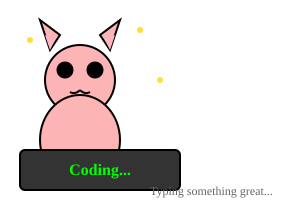

---

<div align="center">
  
</div>

---

##  About Me

I am a developer passionate about building tools for automation, scraping, and web analytics.
I enjoy experimenting with multithreading, performance optimization, and writing efficient scripts.
Currently, I develop tools for:

- Domain WHOIS checks
- IP geolocation & server location analysis
- Web audit automation
- Web Analyst

I am always learning new technologies, love optimization challenges, and aim to continuously improve the quality of my code.

---

## Typing Cat Animation



---

## Programming Languages Statistics

[](https://github.com/purwocode)

[](https://github.com/purwocode)

### GitHub Streak

[](https://github.com/purwocode)

### Tech Stack Favorites

**Web Development**
```
┌─────────────────────────────┐
│ Frontend: JS + HTML/CSS     │
│ Backend:  Python + PHP      │
│ Database: SQL + NoSQL       │
│ Deployment: Docker + Linux  │
└─────────────────────────────┘
```

**Automation & Tools**
```
┌─────────────────────────────┐
│ Python (Primary)            │
│ Bash/Shell (System Level)   │
│ PowerShell (Windows)        │
│ Threading & Async           │
└─────────────────────────────┘
```

---

## Animated Typing Cat Activity


---

## Current Focus

- Building domain extraction & analysis tools
- WordPress vulnerability scanning
- Performance optimization
- Open source contributions

Always excited to collaborate on interesting projects!

